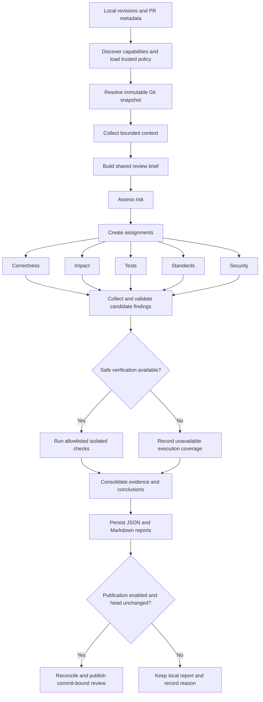

# BOB-2.0
AI-powered PR review tool using IBM Bob 2.0 agent mode. Parallel subagents check correctness, impact, tests, standards &amp; security on a diff, validate findings before posting, and produce a risk-tiered, evidence-backed review report for the human reviewer to act on.


# Review Copilot V2

An evidence-backed, risk-aware pull request review system.

> **Status:** This is a design preview, not finished software. Nothing here has been built or tested yet — it's the plan we're building from.

---

## 1. The problem

Reviewing a pull request properly usually takes 20–40 minutes, even for a developer who knows the codebase well. That time goes into four separate jobs:

1. **Understanding the change** — what the diff actually does, beyond the PR title
2. **Checking downstream impact** — does it break anything else that depends on this code
3. **Checking test coverage** — is the new behavior actually tested, or just touched
4. **Checking conventions** — does it follow the team's coding and security standards

Under time pressure, teams usually do one of two things, and both are bad:

- **Skip the rigor** — reviews get rubber-stamped, and bugs slip into main.
- **Do the rigor anyway** — the review becomes the bottleneck, and PRs sit for a day waiting on a free reviewer.

An earlier version of this idea (a simple four-agent reviewer) helped, but had real gaps:

- It couldn't tell if the code solved the *right* problem — it could pass every check and still miss the actual requirement.
- It treated a one-line doc fix the same as a change to authentication.
- It could mistake a plausible-sounding AI guess for a confirmed bug.
- Its four agents worked in isolation and could miss issues that span code, tests, and config together.
- Its automatic fixes could quietly change behavior or fake test coverage.
- It could present "we didn't check this" as if it meant "this is fine."

**V2 is built specifically to close these gaps.**

---

## 2. The proposed solution

Review Copilot V2 coordinates a team of specialist reviewers around a shared understanding of the change, checks their work before trusting it, and hands the human reviewer a clear, evidence-backed report — not a wall of raw AI output.

**Core principle: evidence before conclusions.** Nothing gets reported as "checked" unless it was actually checked.

At a high level, the system:

1. Reads the exact code change (locked to specific commits, not a moving branch)
2. Builds a shared "brief" of what the change is trying to do
3. Decides how much scrutiny it needs, based on risk
4. Sends the right specialists to investigate in parallel
5. Verifies their findings against real evidence before trusting them
6. Writes up a clear, decision-ready report
7. Never merges, approves, or bypasses your existing review rules — a human always stays in charge

---

## 3. What it does *not* do

This matters as much as what it does:

- It does **not** approve or merge anything on its own
- It does **not** bypass branch protections or required human sign-off
- It does **not** treat "no findings" as proof the code is correct
- It does **not** silently change business logic, weaken a test, or turn off a security check just to make a review pass
- It does **not** claim an integration works before that integration has actually been checked against the real environment

---

## 4. How it works, step by step

### Step 1 — Understand the intent, not just the diff

Before checking anything, it reads the PR description, the changed files, nearby code, and any linked requirements or docs. From that, it builds a **review brief**: what this change is supposed to achieve, what should stay the same, and what's still unclear.

If something is genuinely unclear, it says so rather than guessing. This matters because a change can pass every downstream check and still solve the wrong problem.

### Step 2 — Match review depth to risk

Not every PR deserves the same level of scrutiny:

| Risk level | What triggers it | What happens |
|---|---|---|
| **Low** | Small, clearly limited-scope changes (e.g. a typo fix) | Lightweight, targeted checks only |
| **Medium** | The default when there's not enough information to call it low-risk | Full standard review: correctness, impact, tests, standards, security |
| **High** | Touches auth, payments, sensitive data, public APIs, schemas, or anything with a large blast radius | Full review *plus* specialist checks *plus* required sign-off from a code owner |

Risk is judged by what the change actually *touches*, not how many lines it is — a one-line change to an authorization check is high risk.

### Step 3 — Run specialist checks in parallel

Five reviewers each get the same brief and a narrow, well-defined job:

- **Correctness** — does the implementation do what it claims, including edge cases and error handling?
- **Impact** — what else calls or depends on this code, and could it break?
- **Tests** — is the new behavior meaningfully tested, or just touched by a test that doesn't really check anything?
- **Standards** — does it follow the team's actual written standards, with the specific rule cited?
- **Security** — are there secrets, injection risks, or authorization gaps?

They work independently but share findings through a coordinator, so related issues that span multiple areas still get connected.

### Step 4 — Verify findings before trusting them

An AI reviewer's suspicion is not automatically a valid finding. Before anything is reported, each finding is checked against the actual code — and, where possible, against real evidence like running the relevant tests, linter, or type checker.

If something can't be verified, it's clearly marked **unresolved** — never silently dropped, and never presented as if it passed.

### Step 5 — Fix the trivial stuff, flag the rest

Small, safe, fully deterministic fixes (like formatting) can be applied automatically. Anything involving judgment — a behavior change, a generated test, an ambiguous requirement — is proposed as a separate patch that a human has to explicitly approve.

### Step 6 — Deliver a decision-ready report

The final output isn't a dump of every observation from every reviewer. It's organized around what the human actually needs to decide:

- **Change summary** — what changed, why, and the assessed risk
- **Blocking findings** — confirmed issues that need fixing, with evidence
- **Non-blocking suggestions** — kept clearly separate from real defects
- **Verification record** — what was actually checked, what passed, what couldn't be checked and why
- **Open questions** — decisions that need a human's judgment, not the tool's

If new commits land on the PR, the review re-checks the affected parts rather than leaving a stale approval sitting there.

---

## 5. System pipeline



**In plain terms:** every stage saves its own output before moving to the next one, so if the process gets interrupted, it can pick back up without redoing work or losing evidence.

---

## 6. What we're building first (and what comes later)

The first version is a **local command-line tool**, not a hosted dashboard.

| Area | First version | Added later, once verified |
|---|---|---|
| Input | Local Git commits + a PR metadata file | Reading directly from GitHub's API |
| Review | Real static analysis + one AI model | More specialist reviewers |
| Standards docs | Plain text and Markdown | PDF and Word parsing |
| Storage | Local SQLite file | Shared/hosted storage |
| Output | JSON + Markdown report | Posting comments directly on GitHub |
| Running code | Static analysis only (no execution) | Sandboxed test/build execution |
| Fixes | Read-only (just reports) | Approved, applied patches |
| Bob integration | Not enabled until verified | Enabled once confirmed to work |

**Why start small:** a single tool with a local database is enough to prove the core idea works safely. We don't need a hosted service, a dashboard, or extra infrastructure yet — those are easy to add once the reliability foundation exists.

---

## 7. Tech stack

If we're starting from an empty repository, this is the proposed baseline. (If a repo with existing conventions already exists, we follow those instead.)

| Layer | Choice | Why |
|---|---|---|
| Language | TypeScript (strict mode) | Catches mistakes early, makes contracts explicit |
| Runtime | Node.js (current LTS) | Runs the CLI and coordinates everything |
| Package manager | npm, with a committed lockfile | Reproducible installs |
| CLI framework | Commander | Handles commands and arguments |
| Data validation | [Zod](https://zod.dev) | Checks that AI output and config actually match what we expect, at runtime — not just at compile time |
| Git access | Git CLI | Reads commits and diffs safely |
| Storage | SQLite | Local, transactional, good for audit trails |
| Testing | Vitest | Unit, integration, and workflow tests |
| Linting/formatting | ESLint + Prettier | Keeps the codebase consistent |
| AI model access | A provider-neutral adapter | So we're not locked into one AI vendor |
| Sandboxed execution | A restricted container runner (only once confirmed safe) | Runs tests/linters without giving PR code real system access |
| CI | GitHub Actions | Runs our own test suite automatically |

**A note on exact versions:** we'll pin specific dependency versions once we've actually looked at the environment we're deploying into — not guess them now.

---

## 8. APIs and integrations

The core tool doesn't need its own web server — it only talks to a few external things, each through its own clearly bounded adapter:

- **Git** — reads commits and diffs. Never runs untrusted repo code as shell commands.
- **PR metadata** — starts as a simple JSON file (title, description, base/head commit, linked requirements). Treated as untrusted input, not instructions.
- **AI model provider** — sends only the minimum necessary, redacted context. If a team's privacy rules don't allow sending code externally, the tool says "AI review unavailable" rather than faking it.
- **GitHub REST API** *(added later, once verified)* — three endpoints:
  ```
  GET  /repos/{owner}/{repo}/pulls/{pull_number}
  GET  /repos/{owner}/{repo}/pulls/{pull_number}/reviews
  POST /repos/{owner}/{repo}/pulls/{pull_number}/reviews
  ```
  Reviews will only ever be posted as **comments**, never as automatic approvals, and always tied to the exact commit reviewed.
- **Bob (IBM's agent platform)** — support is currently **unverified**. We're not assuming any specific Bob feature exists until we've actually checked what the environment supports. The core engine is built to work independently of Bob either way.

**The most important security rule underneath all of this:** anything that comes from inside a pull request — the description, the code, comments, linked docs — is treated as data to review, never as instructions the system should follow. A malicious PR description can't talk the reviewer into skipping a check.

---

## 9. Work split: ABY and Rijin

**ABY owns the platform** — making sure the workflow runs reliably, saves progress, and integrates safely with outside systems.

**Rijin owns the review quality** — making sure findings are accurate, well-evidenced, and genuinely useful.

| Area | ABY | Rijin |
|---|---|---|
| Environment discovery | Check runtime, Git, CI, storage, Bob | Check AI models, standards docs, review capabilities |
| Data contracts | Workflow state, snapshots, checks | Briefs, assignments, evidence, findings |
| Core engine | Coordinator and state handling | Review planning and follow-up logic |
| Intake | Git + metadata adapters | Deciding what context matters, reading intent |
| Risk assessment | Persisting decisions, enforcing escalation | Defining the actual risk rules |
| Review | Scheduling, budgets, cancellation | The five specialist reviewers + AI model adapter |
| Validation | Data integrity | Checking claims, removing duplicates |
| Verification | Sandboxed runner, capturing results | Deciding what to check and why |
| Reporting | CLI output, saving results | Writing the report content itself |
| Integrations | GitHub/Bob connections, retry logic | Mapping results into the report format |
| Testing | State handling, storage, resuming | Finding quality, ambiguous cases, adversarial tests |
| Docs | Setup and operations | Architecture and known limitations |

**Shared responsibilities (both people, always):**

- Agree on data contracts *before* building in parallel, so the pieces fit together
- Review each other's changes to anything security-sensitive (execution, publishing, patches)
- Do a joint end-to-end test once a version is ready
- Keep test data used during development separate from the data used to judge whether it works

---

## 10. Milestones

Each milestone ends with something that actually runs, plus real test results — not just new files.

1. **Foundation** — Read real Git commits, save a run, produce a capability report showing what the environment actually supports.
2. **Fixture workflow** — A complete (but clearly fake/test-only) run works end to end, including resuming after an interruption.
3. **Real static review** — A real code diff produces real, traceable findings — no code execution required yet.
4. **Sandboxed verification** — Tests and checks can run safely in isolation, or are clearly marked unavailable.
5. **Optional integrations** — GitHub publishing and approved patches, built carefully to avoid duplicate posts or stale results.
6. **Hardening** — Adversarial testing, real-world evaluation, and full documentation.

---

## 11. Definition of done

We'll consider the first version complete when:

- A real local review runs start to finish
- Every finding can be traced back to actual evidence
- The permission boundaries hold (reviewers can't secretly execute code, post comments, or change policy on their own)
- Our own automated test suite passes

Performance (like the original "3–5 minute review" goal) is something we'll **measure honestly**, not promise upfront.

